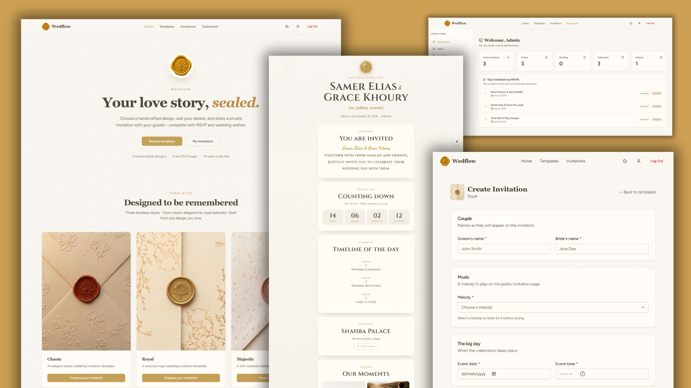

# 💍 Wedflow

## 📚 Overview

Wedflow is a digital wedding invitation platform where couples design personalized e-invites, share them as a beautiful link, and track RSVPs in real time. Guests view a cinematic page with a live countdown, background music, photo gallery and event timeline and respond with their attendance and a personal wish.

## 🖼️ Screenshot



## ✨ Features

- 🗂️ **Invitation templates** - each with a thumbnail and cinematic intro video
- 💌 **Unique shareable link** - each invitation gets its own `/slug` URL
- ✅ **RSVP & wishes** - guests confirm attendance and leave wishes on a public wall
- 🛠️ **Admin panel** - manage invitations, users, templates, etc...
- 📘 **OpenAPI docs** - full Swagger 3.0 spec generated with l5-swagger

## 🧰 Tech Stack

**Frontend**

- ⚛️ React 18 (Inertia.js)
- ✨ Vite 8 (build tool)
- 🎨 Tailwind CSS 3 (styles)
- 🧩 shadcn/ui (components)

**Backend**

- 🐘 PHP 8.3 (language)
- 🟨 Laravel 13 (framework)
- 🗄️ Eloquent ORM (SQLite by default)
- 🔐 Laravel Breeze (session auth)

## 👥 User Roles

Wedflow allows authenticated users to perform actions based on their role:

1. 🛠️ **Admins**

   - Monitor platform stats & top invitations on the dashboard
   - Approve invitations (**pending → active → inactive**)
   - Manage users, template, melody and event catalogs
   - Review all guests responses, searchable & filterable by attendance

2. 💑 **Customers**

   - Browse templates and start a new invitation
   - Create, edit and delete their own invitations
   - Share the unique link and preview before approval
   - View RSVP stats and moderate wishes (show/hide)

## 🗂️ Project Structure

```
app/
├── Http/            # Controllers & Middleware
├── Models/          # Eloquent models
└── Swagger/         # OpenAPI annotations

resources/
├── js/Pages/        # React/Inertia pages
├── js/Components/   # Shared + shadcn/ui components
├── css/             # Global + per-template styles
└── views/           # Root Inertia Blade page

routes/              # web.php & auth.php
database/            # Migrations + seeders
tests/Feature/       # Feature test suite
config/              # Config files
```

## 📘 Swagger & Docs

- 📘 **l5-swagger** - OpenAPI 3.0 spec at `/api/documentation`
- 🧪 `php artisan test` - full feature test suite
- 📘 `composer run docs` → open `/api/documentation`

## What I Learned 📚

My first Laravel project! Here's what I picked up:

1️⃣ **Admin Dashboard Reports** - built stats & summarized RSVP metrics for the admin panel

2️⃣ **Breeze + React + Inertia** - SPA-style workflow with Ziggy typed route helpers

3️⃣ **Swagger** - OpenAPI 3.0 specs with l5-swagger, docs at `/api/documentation`

4️⃣ **MVC Pattern** - Models, Controllers & presentation separated with Laravel conventions

## Conclusion 🎉

Developed by **Beniamin Hekimian** as part of the **Computer Science (Laravel)** training at **ADISC**.